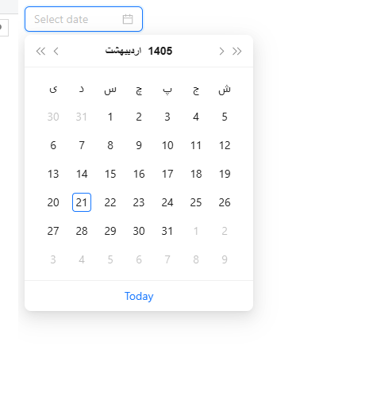

# Ant Design Jalali Date Picker

A Persian (Jalali) calendar date picker component built with Ant Design and React.

## Overview

This project provides a ready-to-use **Jalali (Persian) calendar date picker** that integrates seamlessly with [Ant Design](https://ant.design/) components. It's perfect for Persian-language applications requiring a localized date selection experience.

## Features

- 🗓️ **Jalali Calendar Support** - Full Persian calendar system (Solar Hijri)
- 🎨 **Ant Design Integration** - Uses [`antd`](https://ant.design/components/date-picker) DatePicker component with Persian locale
- 📦 **TypeScript Ready** - Built with TypeScript for type safety
- 🔧 **Customizable** - Extend the base [`DatePickerJalali`](src/components/DatePickerJalali.tsx) component
- ⚡ **Vite Powered** - Fast development build and hot module replacement

## Installation

Clone the repository and install dependencies:

## Usage

### Basic Implementation

### Customizing the Date Picker

The component exposes the underlying Ant Design [`DatePicker`](https://ant.design/components/date-picker) props. You can modify [`DatePickerJalali.tsx`](src/components/DatePickerJalali.tsx) to add features like:

- Date formatting
- Disabled dates
- Range selection
- Custom presets

Example enhancement:

## Project Structure

## Development

Start the development server:

Build for production:

Lint the code:

## Dependencies

- [`react`](https://react.dev/) ^19.2.0
- [`antd`](https://ant.design/) ^6.3.0
- [`dayjalali`](https://www.npmjs.com/package/dayjalali) ^1.0.1 - Jalali calendar conversion
- [`vite`](https://vitejs.dev/) ^7.3.1

## License

Private project - All rights reserved.

## Contributing

This is a demonstration project. For production use, extend the base component with full Jalali calendar configuration using the `dayjalali` library.
